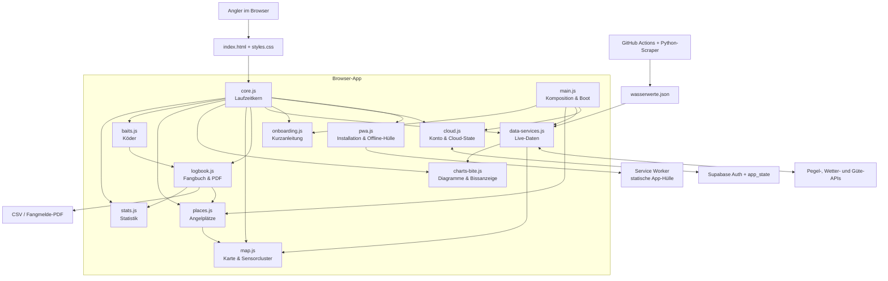
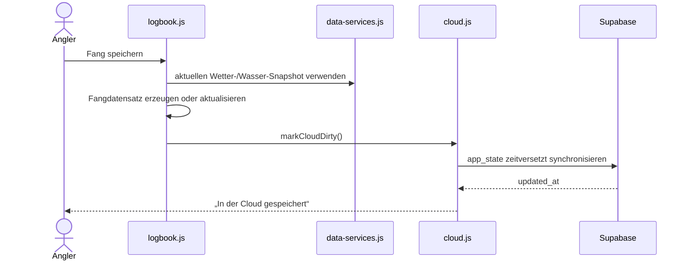

# PetriKlar – Architektur

Stand: 16. August 2026 · Browser-App ohne Build-Schritt

## Ziel

PetriKlar bleibt eine direkt auf GitHub Pages lauffähige Vanilla-JavaScript-App. Der frühere Monolith `app.js` wurde deshalb **ohne Framework- oder Bundler-Zwang** in fachliche Module aufgeteilt. Kleine Änderungen sollen möglichst nur noch eine klar benannte Datei betreffen.

## Struktur

```text
Fishing/
├─ index.html                    # Seitenstruktur und geordnete Script-Einbindung
├─ styles.css                   # gemeinsame Gestaltung und responsive Regeln
├─ app.js                       # Kompatibilitätshinweis; wird nicht mehr geladen
├─ manifest.webmanifest         # PWA-Metadaten und App-Icons
├─ service-worker.js            # App-Hülle, Updates und sichere Cache-Grenzen
├─ offline.html                 # Offline-Hinweis ohne persönliche Daten
├─ legal/                       # Impressum, Datenschutz, Support, Kontolöschung
├─ supabase/                    # RLS- und Kontolöschungs-Migration
├─ report_utils.js              # reine, separat testbare PDF-Berichtslogik
├─ fish_rules.js                # Schonmaße und Schonzeiten
├─ js/
│  ├─ core.js                   # gemeinsamer Zustand, DOM-, Icon- und Format-Helfer
│  ├─ pwa.js                    # Installation, Online-Status und Updates
│  ├─ cloud.js                  # Supabase, Anmeldung, Synchronisation, Migration
│  ├─ onboarding.js             # Kurzanleitung beim ersten Login
│  ├─ data-services.js          # Pegel, Wetter, Wassergüte und Live-Sensordaten
│  ├─ logbook.js                # Trips, Fänge, Bearbeitung, Export, Import und PDF
│  ├─ map.js                    # Leaflet, Cluster, Marker, Fangorte und Schonregeln
│  ├─ charts-bite.js            # Verlaufsdiagramme und Bissprognose
│  ├─ places.js                 # Angelplätze, Messstationswahl und Ansichten
│  ├─ baits.js                  # Köder, Kategorien und Varianten
│  ├─ stats.js                  # Statistik und Personal Best
│  └─ main.js                   # Navigation, App-Komposition und Startvorgang
├─ tests/
│  ├─ module_architecture.test.cjs
│  ├─ catch_actions_onboarding.test.cjs
│  ├─ mobile_report_layout.test.cjs
│  └─ pdf_report.test.cjs
├─ fetch_wasserwerte.py         # stündliche Sensor-Datenpipeline
├─ wasserwerte_update.py        # ergänzende Aktualisierungslogik
├─ wasserwerte.json             # von GitHub Actions erzeugte App-Daten
└─ .github/workflows/           # Abruf und Veröffentlichung
```

## Systemübersicht



## Ladeprinzip

Die Dateien sind weiterhin klassische Browser-Skripte. Dadurch bleiben bestehende `onclick`-Handler und GitHub Pages kompatibel. Es gibt keinen Build-Schritt. Die Reihenfolge in `index.html` ist verbindlich:

1. externe Bibliotheken und Datendateien,
2. `core.js`,
3. Infrastruktur (`pwa.js`, `cloud.js`, `onboarding.js`, `data-services.js`),
4. Fachmodule (`logbook.js`, `map.js`, `charts-bite.js`, `places.js`, `baits.js`, `stats.js`),
5. `main.js` als einziger Startpunkt.

`main.js` enthält als einziges Modul den Aufruf `boot()`. Alle anderen Module definieren nur Zustand und Funktionen.

## Verantwortlichkeiten

| Änderung | Primäre Datei |
|---|---|
| Login, Konto, Supabase-Speicherung | `js/cloud.js` |
| Installation, Offline-Hinweis, Service-Worker-Updates | `js/pwa.js` und `service-worker.js` |
| Impressum, Datenschutz, Support | `legal/` und `legal/legal-config.js` |
| Texte oder Ablauf der ersten Einführung | `js/onboarding.js` |
| Sensorquellen, Wetter, Wasserwerte | `js/data-services.js` |
| Fang speichern, bearbeiten oder löschen | `js/logbook.js` |
| CSV, Upload oder Fangmelde-PDF | `js/logbook.js` und bei reiner Berichtslogik `report_utils.js` |
| Kartenmarker, Sensorcluster, Fangort | `js/map.js` |
| Bissprognose oder 7-Tage-Diagramme | `js/charts-bite.js` |
| Angelplatz anlegen oder Messstation wählen | `js/places.js` |
| Köder und Varianten | `js/baits.js` |
| Personal Best oder Erfolgsstatistik | `js/stats.js` |
| Startansicht, Navigation oder App-Start | `js/main.js` |
| Farben, Abstände und mobile Darstellung | `styles.css` |

## Abhängigkeitsregeln

1. **Kein Fachcode in `app.js`.** Die Datei ist nur ein Hinweis für ältere Verweise.
2. **`core.js` bleibt klein.** Nur wirklich gemeinsam verwendete Zustände und Helfer gehören dort hinein.
3. **Datenzugriff und Darstellung trennen.** Neue Sensorabrufe kommen in `data-services.js`; Kartenlogik bleibt in `map.js`.
4. **Nur `main.js` startet die App.** Kein anderes Modul ruft `boot()` auf.
5. **Cloud-State zentral halten.** Persönliche Daten werden über `APP_STATE` und `markCloudDirty()` gespeichert, nicht in zusätzlichen LocalStorage-Schlüsseln.
6. **Reine Logik separat testen.** Berechnungen ohne DOM gehören nach Möglichkeit in kleine Utility-Dateien wie `report_utils.js`.
7. **Neue Dateien am Ende nicht blind einbinden.** Die erforderliche Ladeposition muss in dieser Dokumentation und im Architekturtest ergänzt werden.

## Datenfluss eines Fangs



## Prüfung nach Änderungen

Vom Repository-Verzeichnis aus:

```powershell
node --check js/core.js
node --check js/main.js
node --test tests/*.test.cjs
```

Der Architekturtest kontrolliert zusätzlich:

- Vorhandensein aller Module,
- richtige Lade-Reihenfolge,
- genau einen App-Startpunkt,
- eindeutige globale Funktionsnamen,
- Strict Mode in jedem Modul.

## Vorgehen für kleine Änderungen

1. In der Verantwortungstabelle das zuständige Modul wählen.
2. Nur dieses Modul und den dazugehörigen Test ändern.
3. Bei sichtbaren Änderungen die Cache-Version des betroffenen Scripts in `index.html` erhöhen.
4. Syntax- und Gesamttests ausführen.
5. Erst danach committen und veröffentlichen.
